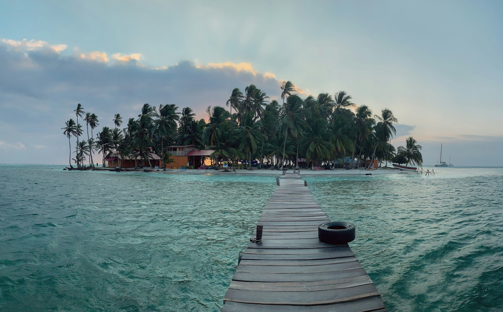
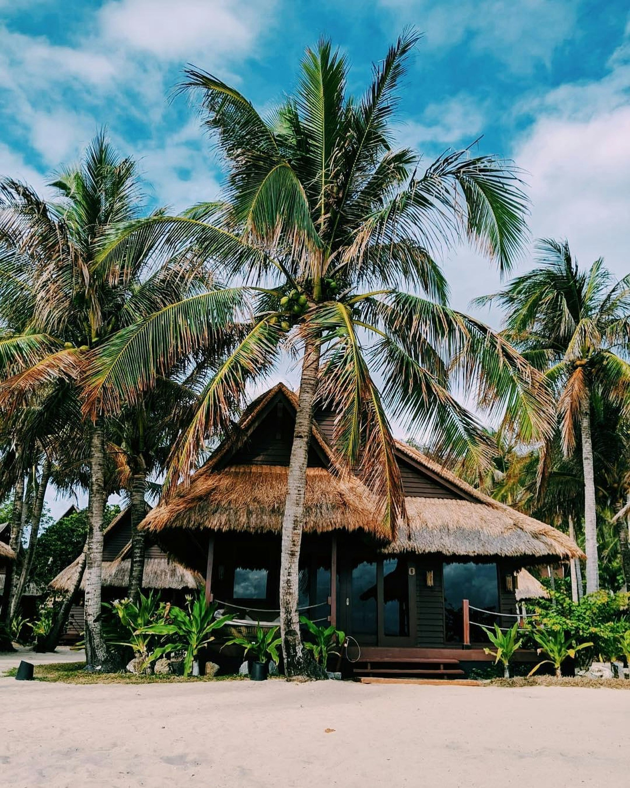

<!doctype html>
<html lang="en">
<head>
<meta charset="UTF-8">
<meta name="viewport" content="width=device-width, initial-scale=1.0">
<link rel="stylesheet" href="landingpage.css">
<link rel="preconnect" href="https://fonts.googleapis.com">
<link rel="preconnect" href="https://fonts.gstatic.com" crossorigin>
<link href="https://fonts.googleapis.com/css2?family=Righteous&family=Urbanist:ital,wght@0,100..900;1,100..900&display=swap" rel="stylesheet">
<link rel="stylesheet" href="https://use.typekit.net/gur0egp.css">	
	
<title>LuxMarina</title>
	
<link rel="icon" type="image/x-icon" href="Assets/lm_favicon.svg">
	
</head>

<body>

	<!--nav-bar starts here-->	
	
<header class="header">
  
 

  <nav>
    <ul class="nav-bar">
      <li><a href="about.html">ABOUT</a></li>
      <li><a href="services.html">SERVICES</a></li>
      <li><a href="staff.html">STAFF</a></li>
      <li><a href="contact.html">CONTACT</a></li>
    </ul>
  </nav>
</header>
	
<!--landing page starts here-->		
	

 	 
	
 
		<h1>Your Exclusive Gateway  
To Private Island Retreats.</h1>
	

 	<a href="services.html"> EXPLORE</a>
	
 
	

<!--About section1 starts here-->	
	<section class="about1">
      

		
 
		

       		 <h1>ULTIMATE</h1> 
		

		
		

			
Hands-on and relationship-driven, we’ll leverage our network—built over a decade in the luxury travel industry— to ensure that every trip is thoughtfully executed and guaranteed to exceed expectations. 
  
		
  
		  
		

			 <h1>GETAWAY</h1> 
		
  
		
 	
		  
		

			 
		
  
	  

	</section>
	
	<!--About Section 2 Starts here-->
	<section class="about2">
		

			

			<h1>ESCAPE TO YOUR OWN PRIVATE PRADISE</h1>
			

			
			

			
FULL-SERVICE, VIRTUOSO AFFILIATED TRAVEL ADVISORY FOR THE MODERN TRAVELER. 

			

		

	</section>
	
	
<!--Services section starts here-->
<section class="services">

  

	<h3>PRIVATE ISLAND</h3>
    
    <ul>
      <li>Breakfast daily</li>
      <li>Spa, dining, or resort credit</li>
      <li>Exclusive amenities and experiences</li>
    </ul>
  

  
  

	<h3>LIGHT AIRCRAFT SERVICE</h3>
    
    <ul>
      <li>Dedicated onboard hosts</li>
      <li>Exclusive welcome receptions</li>
      <li>Private shore excursions and private port tours</li>
    </ul>
  

  
  

	<h3>FULL-SERVICE CATERING</h3>
    
    <ul>
      <li>Food and wine</li>
      <li>Private chef catering</li>
      <li>Allergen-free</li>
    </ul>
  

</section>
	
<!--Staff section starts here-->	
	<section class="staff">
	
	
		

        

            <!-- You should replace 'profile.jpg' with the actual path to your image file -->
            
        
 
		

			<h1>TRAVEL DESIGNER</h1>
		
	
			
		

			<h2>Claire Robbins</h2>	
		
	
		
	
		
        

			

			<h1>CONTACT WITH CLAIRE</h1>
			
			

                <!-- Replace '#' with actual URLs -->
                
                   
        	

			

			
            
Claire is based in Washington, D.C. She spent over ten years in the luxury event planning industry. 

 
Claire’s food-loving background makes her the perfect fit for clients who especially want to enjoy every bite during their travel experience. With a passion for meticulous service, where no detail goes unnoticed, Claire loves to deliver bespoke itineraries for her clients that are truly one-of-a-kind.  

 
Claire is excited to leverage her extensive personal knowledge of luxury travel with her passion for delivering meaningful travel experiences for her clients.

		

	

	</section>
	
<!--Contact section starts here-->	
	<section class="contact">
	  

		

       		 <h1>Welcome</h1> 
			 <h1>Any</h1> 
			 <h1>Enquiries</h1>
		

	
        

            <h3>Address</h3>
				
1423 Fairfax Dr, VA, US

			<h3>General inquiries</h3>
				
info@luxmarina.com | +1 09 287 546

			<h3>Follow us</h3>
            <!-- Social media links -->
            

                <!-- Replace '#' with actual URLs -->
                
                
                
                
            
        	

		  

    	

	</section>
	
<!--Footer starts here-->	
	<footer>
        
© 2024 LUXMARINA All Rights Reserved.

    </footer>	
	

	
</body>
</html>
